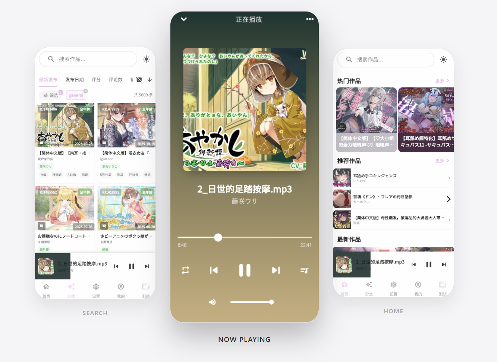

<div align="center">
  

  # Kikoenai

  **面向同人音声与音视频作品的跨平台媒体库和播放器。**

  [](https://github.com/karson-z/Kikoenai/releases)
  [](https://github.com/karson-z/Kikoenai)
</div>

Kikoenai（聴こえない）将在线作品浏览、本地媒体、云盘文件和 DL 元数据整理到同一个播放器中。应用使用作品的 RJ 编号关联不同资源来源，适合已经拥有本地收藏、AList/WebDAV 文件或自建 Kikoeru 服务的用户。

## 应用预览

<div align="center">
  
</div>

## 当前功能

### 发现与作品管理

- 首页提供热门、推荐和最新作品，并支持网格/列表布局切换。
- 分类页支持排序、字幕条件、关键词、标签、声优、社团、年龄、时长、评分、价格和销量等筛选。
- 全局搜索支持按作品、作者或标签查找。
- 作品详情展示封面、标签、声优、评分、评论和媒体文件列表。
- 支持登录、在线标记、评分、评论、收藏歌单和播放列表；具体能力会根据当前内容站点开放的功能动态显示。

### 本地媒体

- 在“本地媒体”中添加一个或多个扫描目录。
- 分别扫描音频、视频和字幕文件，建立本地媒体索引。
- 支持按 RJ 编号关联作品，进入文件夹浏览、预览和播放。
- 扫描和元数据解析可在后台队列中执行，支持增量同步、刷新和路径管理。

### 云盘

- **AList**：管理多个 AList 域名，在当前目录内搜索和浏览文件。
- **WebDAV**：配置服务器、账号、密码和起始目录，支持目录浏览、刷新和断开连接。
- 目录采用原位切换，返回上一级时保留之前的列表、面包屑和滚动状态。
- WebDAV 连接成功后可建立 RJ 目录索引，供 DL 详情快速定位资源；索引过期后会自动更新，也可以手动更新。

### DL 库

- 使用 DLSite 抓取作品标题、封面、社团、标签、声优、评分、价格和销量等元数据。
- DLSite 声优信息缺失时，会尝试从 HVDB 补充；DLSite/HVDB 只用于元数据，不直接作为媒体播放源。
- 支持按标题、RJ 编号、社团、标签、声优、年龄、字幕、时长、评分、价格和销量筛选。
- 提供后台解析队列，可暂停、继续、重试和清理任务。
- DL 详情会按 RJ 编号并行查找本地媒体、内容站点、当前 AList 和 WebDAV 资源，并在详情页中切换已命中的来源。不同来源和不同目录不会被错误合并。

### 播放器与字幕

- 支持音频和视频播放，提供播放队列、上一首/下一首、拖动进度、音量、倍速、列表循环、单曲循环和随机播放。
- 播放历史、进度和队列状态会持久化，重新打开应用后可以继续收听。
- 支持字幕文件匹配、字幕轨道切换、歌词样式、字体和颜色设置。
- 视频播放时支持手势调节音量和屏幕亮度，松手后恢复系统亮度。
- Android 支持桌面悬浮歌词、点击穿透，以及通知栏/锁屏媒体控制中心的桌面歌词按钮。

### 个性化与维护

- 浅色、深色和跟随系统主题，支持主题色和全局字体预设。
- 支持缓存、播放器状态、扫描索引、元数据和登录凭证的分类管理。
- 提供系统权限状态、日志查看、站点服务器切换和站点不可用提示。

## 资源来源

| 来源 | 用途 | 配置位置 |
| --- | --- | --- |
| 本地文件 | 播放设备上的音频、视频和字幕 | 本地媒体 → 文件夹管理 |
| ASMR.ONE | 在线搜索、推荐、作品详情和音轨 | 内置镜像，启动时自动选择可用节点 |
| Kikoeru 自建站 | 连接用户自己的 Kikoeru Express 服务 | 设置 → 站点/服务器管理 |
| AList | 浏览和播放 AList 中的云盘文件 | 设置 → AList 域名 |
| WebDAV | 浏览和播放 WebDAV 中的云盘文件 | 设置 → WebDAV 连接 |
| DLSite / HVDB | 抓取 DL 库的作品元数据 | DL 库 → 解析队列 |

DL 详情的媒体来源由 RJ 编号聚合。已下载文件优先使用本地路径；AList 会对 `RJ{id}` 和 `RJ0{id}` 做完整 RJ 号校验；WebDAV 使用 RJ 目录索引，命中后只递归加载候选目录。

## 平台说明

Kikoenai 可在 Android、iOS、Windows、macOS 和 Linux 上使用。不同平台的具体能力如下：

| 能力 | Android | iOS | Windows/macOS/Linux |
| --- | :---: | :---: | :---: |
| 在线/本地音视频播放 | ✓ | ✓ | ✓ |
| 本地目录扫描 | ✓ | ✓ | ✓ |
| AList / WebDAV | ✓ | ✓ | ✓ |
| 系统后台音频控制 | ✓ | ✓ | 取决于平台媒体会话支持 |
| 桌面悬浮歌词 | ✓ | - | - |
| 通知栏自定义歌词按钮 | ✓ | - | - |

Android 的本地扫描需要文件/媒体权限；桌面悬浮歌词需要“显示在其他应用上层”权限。没有配置相应内容站点或云盘时，本地媒体和 DL 库仍可以独立使用。

## 下载安装

- Android APK 和 Windows 便携包/安装包可在 [GitHub Releases](https://github.com/karson-z/Kikoenai/releases) 下载。
- iOS、macOS 和 Linux 当前提供源码构建方式，请按照下方开发者说明配置对应平台工具链。
- 发布版本会随 `v*` 标签自动构建；安装前请确认设备满足平台要求，并为本地媒体和悬浮歌词授予必要权限。

<details>
<summary>从源码运行（开发者）</summary>

项目使用 FVM 固定 Flutter `3.47.1`，Dart 版本要求为 `>=3.12.0 <4.0.0`。

```sh
git clone https://github.com/karson-z/Kikoenai.git
cd Kikoenai
fvm install
fvm flutter pub get
fvm dart run build_runner build --workspace
fvm flutter run
```

项目脚本 `scripts/kiko` 提供依赖获取、代码生成、运行、分析、测试和校验命令。Windows 便携包可在 Windows 的 Git Bash、MSYS2 或 Cygwin 中运行 `./build-windows.sh` 构建。

</details>

## 数据与权限

- 账号、播放历史、播放器状态、扫描结果、DL 元数据和应用设置保存在设备本地。
- WebDAV 密码通过系统凭据存储保存，README、日志和索引不应包含密码或令牌。
- 网络资源是否可用取决于用户配置的站点、AList、WebDAV 和本地网络环境。
- 请确认自己拥有或获准访问所播放的音视频资源，并遵守相关服务的使用条款和当地法律。

## 相关链接

- [GitHub 仓库](https://github.com/karson-z/Kikoenai)
- [版本与构建产物](https://github.com/karson-z/Kikoenai/releases)
